<!-- textura-banner -->
<div align="center">
  <a href="https://github.com/beepboop2025/medprep-ai"></a>
</div>

# MedPrep AI

AI-powered medical exam preparation with 4,000+ MCQs across 21 subjects. Built with Next.js 16 and Claude.


## Features

### Quiz Mode
- **4,183 medical MCQs** from the MedMCQA dataset
- **21 subjects**: Medicine, Surgery, Pathology, Anatomy, Pharmacology, and more
- Instant answer verification with expert explanations
- Filter by subject, configurable quiz size (5/10/20/50)
- Live score tracking with progress bar

### AI Tutor (Claude-powered)
- Ask any medical question — get exam-relevant explanations
- **RAG pipeline**: retrieves the 5 most relevant questions from the database for every query using IDF-weighted keyword search
- Click "Ask AI to explain further" on any quiz question for deep analysis
- Mnemonics, differential diagnoses, and high-yield exam tips
- Streaming responses via AI SDK v6

## Tech Stack

| Layer | Technology |
|-------|-----------|
| Framework | Next.js 16 (App Router, Turbopack) |
| AI | Claude Sonnet 4.6 via AI SDK v6 |
| Retrieval | IDF-weighted keyword search (zero-dependency RAG) |
| Styling | Tailwind CSS v4, Geist font |
| Language | TypeScript 5 |
| Dataset | [MedMCQA](https://medmcqa.github.io/) (182K+ questions) |

## Getting Started

### Prerequisites
- Node.js 20+
- An [Anthropic API key](https://console.anthropic.com/)

### Setup

```bash
# Clone the repo
git clone https://github.com/beepboop2025/medprep-ai.git
cd medprep-ai

# Install dependencies
npm install

# Set up environment variables
cp .env.example .env.local
# Edit .env.local and add your ANTHROPIC_API_KEY

# Start the dev server
npm run dev
```

Open [http://localhost:3000](http://localhost:3000).

> **Note**: Quiz mode works without an API key. The AI Tutor requires an Anthropic API key.

## Architecture

```
src/
├── app/
│   ├── page.tsx              # Landing + Quiz + Chat views
│   ├── layout.tsx            # Root layout with dark theme
│   └── api/
│       ├── chat/route.ts     # Claude chat with RAG context injection
│       ├── questions/route.ts # Question API (random, filtered, stats)
│       └── check/route.ts    # Answer verification
├── components/
│   ├── quiz-card.tsx         # MCQ card with option selection
│   ├── chat-panel.tsx        # AI tutor chat interface
│   ├── subject-picker.tsx    # Subject filter sidebar
│   └── score-bar.tsx         # Score + progress display
└── lib/
    ├── questions-db.ts       # Question store + RAG search engine
    ├── questions.json        # 4,183 MedMCQA questions (JSONL)
    └── utils.ts              # Tailwind utilities
```

### RAG Pipeline

Instead of fine-tuning, we use Retrieval-Augmented Generation:

1. User sends a query to the AI Tutor
2. The query is tokenized and matched against an inverted index of all 4,183 questions
3. Top 5 matches are ranked by IDF score (rare medical terms get higher weight)
4. Matched questions + explanations are injected into Claude's system prompt
5. Claude generates a response grounded in the actual dataset

This approach is more accurate than fine-tuning for factual Q&A, cheaper (no training cost), and instantly updatable.

## Fine-Tuning Data (Optional)

The `scripts/` directory contains tools to convert MedMCQA into chat-format JSONL for fine-tuning any model:

```bash
python3 scripts/prepare_finetune_data.py
# Output: scripts/data/train_chat.jsonl (167K records)
#         scripts/data/val_chat.jsonl (2.8K records)
```

## Dataset

This project uses the [MedMCQA](https://medmcqa.github.io/) dataset:

> MedMCQA is a large-scale, Multiple-Choice Question Answering (MCQA) dataset designed to address real-world medical entrance exam questions. It covers 2,400+ healthcare topics across 21 medical subjects.

**Citation:**
```bibtex
@InProceedings{pmlr-v174-pal22a,
  title     = {MedMCQA: A Large-scale Multi-Subject Multi-Choice Dataset for Medical domain Question Answering},
  author    = {Pal, Ankit and Umapathi, Logesh Kumar and Sankarasubbu, Malaikannan},
  booktitle = {Proceedings of the Conference on Health, Inference, and Learning},
  year      = {2022},
  volume    = {174},
  series    = {Proceedings of Machine Learning Research},
  publisher = {PMLR},
}
```

**Licensing & ownership:** The MedMCQA dataset is released by its authors under the MIT
License. The questions are real AIIMS &amp; NEET-PG entrance-exam questions; the content in
`src/lib/questions.json` belongs to the MedMCQA authors and is used here under their terms,
**not** claimed as original to this project. This project's own code is MIT-licensed separately
(below). The "AI" in MedPrep AI refers to the Claude-powered tutor and explanations — the
question bank itself is sourced from MedMCQA, not AI-generated.

## License

This project's **code** is licensed under the MIT License. The bundled **question data** is
the property of the MedMCQA authors (see *Dataset* above) and is not relicensed here.
